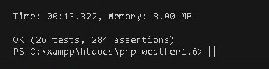
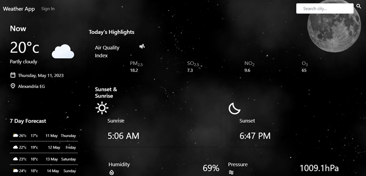
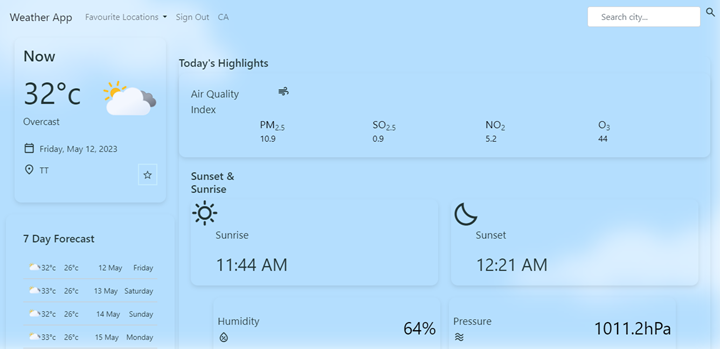

# Weather App 
This is a simple weather app that allows you to check current weather for your current location or any other city.
## Table of contents
* [Description](#description)
* [Technologies](#technologies)
* [API's used](#apis-used)
* [Setup](#setup)
* [Unit Testing](#unit-testing)
* [Demo Pictures](#demo-pictures)
* [Demo Video](#demo-video)

## Description
This project is a simple weather app that allows you to check current weather for your current location or any other city. It was created to practice using software engineering principles and to learn how to use API's.

It includes a database for storing user information and a login system.

The database contains two tables: users and cities. The users table stores user information and the favourite locations of each user.

A light and dark mode is available according to the selected location's sunrise and sunset times.

## Technologies
Project is created with:
HTML/CSS
Bootstrap
JavaScript
PHP 
XAMPP
MySQL

## API's used
- [Open Meteo](https://open-meteo.com/en/docs) - used to get weather data as well as search for cities
- [IP info](https://ipinfo.io/) - used to get user's current location
- [Big Data Cloud](https://www.bigdatacloud.com/) - used for reverse geocoding to get city and country names from latitude and longitude
- [Geonames](https://www.geonames.org/) - used to get timezone information from latitude and longitude

## Setup
To run this project:
- Install XAMPP
- Clone this repository into the htdocs folder in XAMPP
- Start Apache and MySQL in XAMPP
- Create a database called weatherforecast in phpMyAdmin
- Use the DDL.sql file to create the tables
- Use the DML.sql file to insert some data into the tables

The database should now be set up and you should be able to run the project.

## Unit Testing
To run the unit tests:
- Install PHPUnit
- Navigate to the tests folder in the project
- Create a database called test using the DDL.sql file
- Run the following command:
```
php vendor/bin/phpunit tests --display-warnings
```

<!-- Demo -->
## Demo Pictures
<p style="text-align: center; font-weight: bold;">


*Night Mode*
</p>
<p>


*Day Mode*
</p>

**Additional screenshots can be found in the demo/screenshots folder.**
## Demo Video

./demo/videos/video1933436491.mp4

./demo/videos/video2643858070.mp4

./demo/videos/video3899539420.mp4


## Contributors
- [Hager Ahmed](https://github.com/hager46)
- [Mariem Mostafa](https://github.com/MariemMostafa)